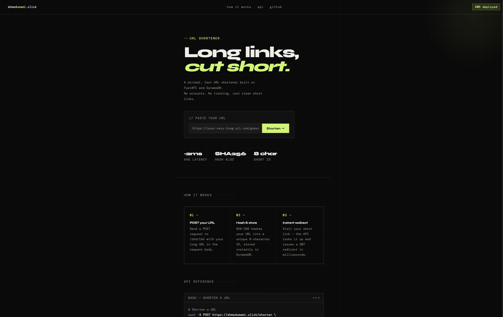
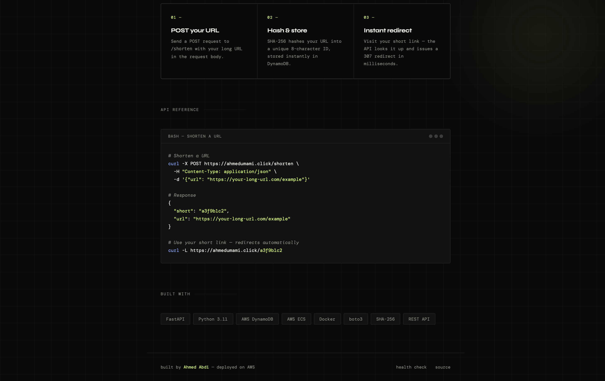
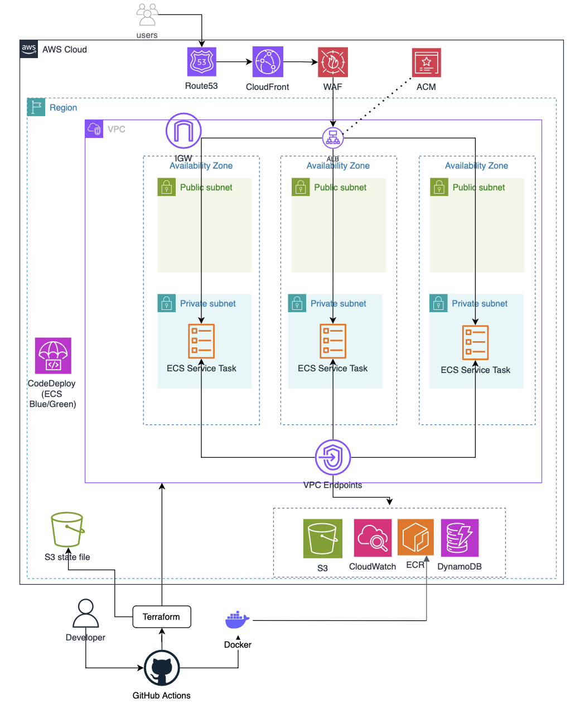
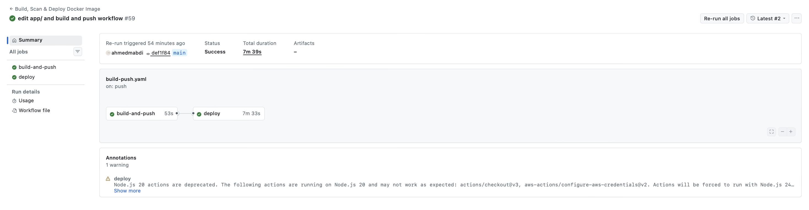
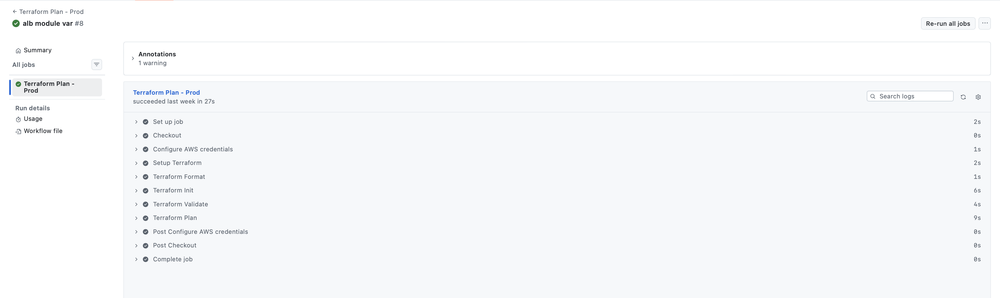
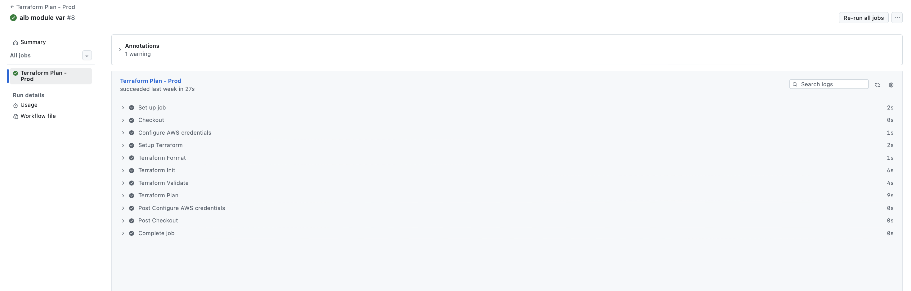
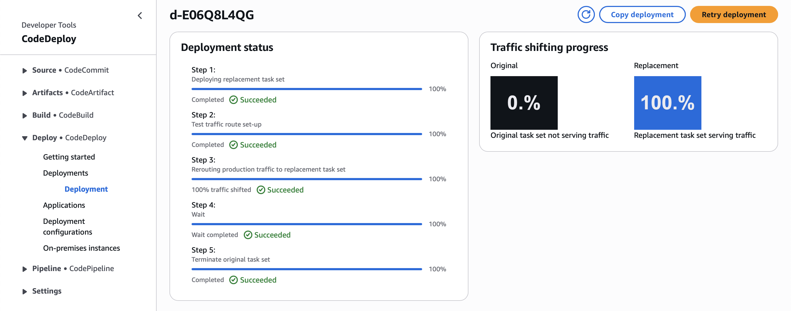
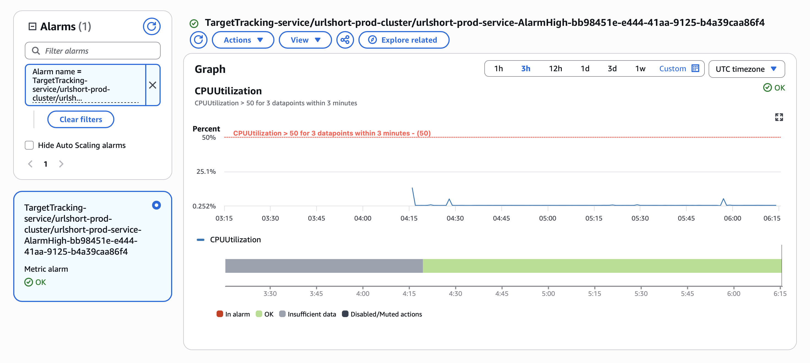
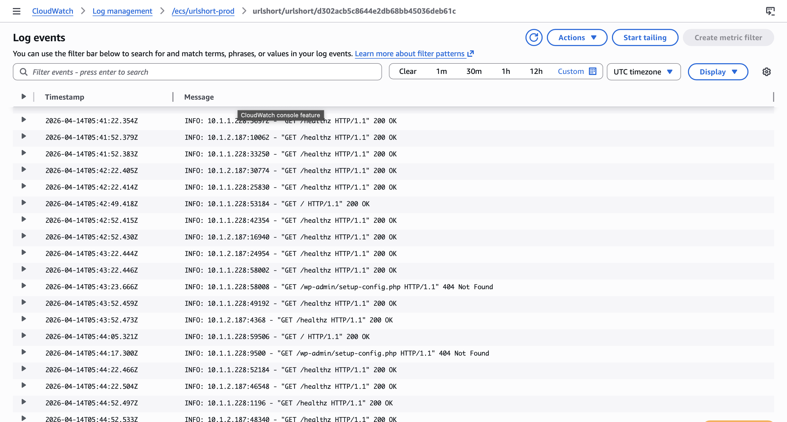

# URL Shortener — Production AWS Deployment

A production-ready URL shortener API deployed on AWS ECS Fargate. This is a solo cloud engineering project focused on the infrastructure, networking, security and deployment pipeline needed to run a containerised application in a professional AWS environment.

The aim wasn’t to build an application, but to deploy one properly. Rather than stopping at “it runs on ECS”, the project follows the patterns you’d expect in a real production environment: private subnets with no NAT Gateway, VPC endpoints for all AWS service traffic, least-privilege IAM, WAF at the edge, OIDC-based CI/CD with no static credentials, and zero-downtime blue/green deployments with automatic rollback.

Every layer, from the VPC design to the GitHub Actions pipeline, was built and debugged from scratch.

---

## Homepage




The homepage provides a clean interface to shorten URLs, a curl API reference, and links to the GitHub repository.

---

## What Is This?

A URL shortener REST API that accepts a long URL, hashes it using SHA-256 (8-character ID), stores the mapping in DynamoDB, and issues a redirect when the short link is visited.

**Core API:**

```bash
# Shorten a URL
curl -X POST https://ahmedumami.click/shorten \
  -H "Content-Type: application/json" \
  -d '{"url": "https://your-long-url.com/example"}'

# Response
{ "short": "a3f9b1c2", "url": "https://your-long-url.com/example" }

# Visit short link — issues 307 redirect
curl -L https://ahmedumami.click/a3f9b1c2

# Health check
curl https://ahmedumami.click/healthz
```

---

## Architecture



**High-level flow:**

```
User → Route 53 → CloudFront → ALB (HTTPS:443) → ECS Fargate → DynamoDB
                                     ↑
                              WAF (rate limiting + managed rules)
```

**Blue/Green deployment flow:**

```
GitHub Push → GitHub Actions → ECR (new image) → CodeDeploy
                                                      ↓
                                          New task on test TG (port 8081)
                                                      ↓
                                          Health check passes
                                                      ↓
                                          Traffic shifts to prod TG (port 443)
                                                      ↓
                                          Old task is drained and terminated
```

---

## AWS Services Used

| Service | Purpose |
|---|---|
| **ECS Fargate** | Runs containerised FastAPI app. A serverless compute, no EC2 management |
| **ECR** | Stores Docker images per environment, tagged by git SHA |
| **ALB** | Application Load Balancer — HTTPS termination, health checks, blue/green listener switching |
| **DynamoDB** | Serverless key-value store for URL mappings (`id` → `url`) |
| **Route 53** | DNS hosting — A record aliased to ALB |
| **SNS** | Delivers alert notifications to subscribers (via email) when CloudWatch alarms fire |
| **ACM** | TLS certificates for `ahmedumami.click` (ALB) and CloudFront (us-east-1) |
| **CloudFront** | CDN — caches and accelerates global traffic, HTTPS enforcement |
| **WAF** | Web Application Firewall, AWS managed rules + IP-based rate limiting (1000 req/IP) |
| **CodeDeploy** | Orchestrates blue/green ECS deployments with automatic rollback on failure |
| **CloudWatch** | Log groups per environment, CPU-based auto-scaling alarms, ECS Container Insights |
| **IAM** | Least-privilege roles with separate execution role (ECR/CloudWatch) and task role (DynamoDB only) |
| **VPC** | Isolated network. Public subnets (ALB) & private subnets (ECS tasks) |
| **VPC Endpoints** | Private connectivity to DynamoDB and ECR without internet traversal |
| **Security Groups** | ALB SG (80/443/8081 inbound), ECS SG (8080 from ALB only) |
| **IGW** | Internet Gateway for public subnet outbound traffic (ALB) |
| **S3** | Stores CodeDeploy AppSpec files per environment |

### VPC Design

```
VPC (10.0.0.0/16)
├── Public Subnets (3 AZs)  — ALB
│   ├── eu-west-2a
│   ├── eu-west-2b
│   └── eu-west-2c
└── Private Subnets (3 AZs) — ECS Tasks (no NAT gateway)
    ├── eu-west-2a
    ├── eu-west-2b
    └── eu-west-2c
```

> **No NAT Gateway** — ECS tasks in private subnets communicate with AWS services (DynamoDB, ECR, CloudWatch) exclusively via VPC Interface Endpoints and Gateway Endpoints. This eliminates NAT Gateway costs (~$32/month) while maintaining full network isolation. 

> **VPC DHCP Options** — A custom DHCP option set is configured to use AmazonProvidedDNS. This makes sure VPC endpoint DNS resolution works properly inside the VPC. Without it, private DNS names for services like "ecr.eu-west-2.amazonaws.com" won’t resolve to the endpoint’s private IPs, which would break ECR image pulls from private subnets.

**CloudFront** — Acts as the single entry point for all user traffic. It enforces HTTPS, caches static responses at edge locations globally, and shields the ALB from direct exposure to the internet. The ACM certificate is provisioned in us-east-1 as required by CloudFront. Reducing latency for geographically distributed users and offloads traffic from the origin.

**WAF** — two Web ACL instances are deployed: one attached to the ALB (regional) and one attached to the CloudFront distribution (global). Both apply the AWS Managed Common Rule Set, which blocks common web exploits including SQL injection, XSS, and known bad inputs. A rate-limiting rule blocks any single IP exceeding 1000 requests per minute, protecting against brute force and basic DDoS attempts. Using WAF at both layers ensures protection regardless of whether traffic arrives via CloudFront or directly hits the ALB.

### IAM — Least Privilege

Two separate roles are used, following least-privilege principles:

**ECS Execution Role** (used by the ECS agent, not the app):
- `ecr:GetAuthorizationToken`, `ecr:BatchGetImage` — pull images from ECR
- `logs:CreateLogStream`, `logs:PutLogEvents` — write to CloudWatch

**ECS Task Role** (used by the running container):
- `dynamodb:PutItem`, `dynamodb:GetItem` on the specific table ARN only — nothing else

---

## CI/CD Pipeline

### GitHub Actions — Build, Scan & Deploy

The pipeline triggers on pushes to `dev`, `staging`, or `main` branches when files that are in `app/**` change.



**Pipeline stages:**

```
push to main
     │
     ▼
┌─────────────────────┐
│   build-and-push    │
│  1. Checkout code   │
│  2. Detect env      │
│  3. Configure AWS   │  ← OIDC (no static credentials)
│  4. Login to ECR    │
│  5. Build image     │  ← tagged: prod-{git-sha}
│  6. Trivy scan      │  ← blocks on CRITICAL CVEs
│  7. Push to ECR     │
└─────────────────────┘
          │
          ▼
┌─────────────────────┐
│      deploy         │
│  1. Register task   │  ← new task def with new image
│  2. Upload AppSpec  │  ← to S3
│  3. Trigger CD      │  ← CodeDeploy blue/green
│  4. Wait for result │  ← fails pipeline if deploy fails
└─────────────────────┘
```

**Key design decisions:**

- **OIDC authentication** — no long-lived AWS credentials stored in GitHub Secrets. The pipeline assumes an IAM role via GitHub's OIDC provider, scoped per environment (`dev`/`staging`/`prod`).
- **Trivy image scanning** — pipeline fails on unfixed CRITICAL CVEs before any image reaches ECR.
- **Environment isolation** — separate ECR repos, IAM roles, ECS clusters, and DynamoDB tables per environment.
- **Git SHA tagging** — every image is tagged `{env}-{git-sha}` for full traceability.

### Terraform — Infrastructure Pipelines

Infrastructure is provisioned per environment using Terraform. Each environment has its own root module under `terraform/env/` with its own state, variables, and backend — changes to one environment's infrastructure are completely isolated from another. All three environments are identical in architecture: VPC, ECS Fargate, ALB, WAF, CloudFront, DynamoDB, and CloudWatch are all provisioned across `dev`, `staging`, and `prod`. The only differences are resource names, DynamoDB table names, IAM roles, and ECR repositories — the infrastructure shape is the same.

The ECS service uses a `CODE_DEPLOY` deployment controller which means Terraform must not attempt to manage the running task definition.

**Terraform Plan — prod**



**Terraform Apply — prod**



### CodeDeploy — Blue/Green



CodeDeploy manages the actual traffic shift:

1. New ECS task starts on the **test target group** (port 8081)
2. ALB health checks run against `/healthz`
3. Once healthy, traffic shifts from blue → green on port 443
4. Old task is drained and terminated
5. If health checks fail at any point, automatic rollback to the previous task

This gives zero-downtime deployments with automatic rollback — no manual intervention required.

---
## Cost Optimisation

Running a production-grade AWS environment doesn't have to be expensive. Several deliberate architecture decisions were made to minimise cost without compromising security or reliability.

- **No NAT Gateway**
NAT Gateway costs ~$32/month before data processing fees. Instead, VPC Interface Endpoints and Gateway Endpoints route all AWS service traffic (ECR, DynamoDB, CloudWatch) privately. Gateway Endpoints (S3, DynamoDB) are free. Interface Endpoints cost less than NAT at any meaningful traffic volume.

- **Fargate over EC2**
No EC2 instances to size, patch, or pay for when idle. Fargate charges only for the CPU and memory allocated to running tasks. With `256 CPU` and `512MB` memory, the base cost per task is minimal, and the auto-scaling policy scales down to minimum capacity during low traffic periods.

- **DynamoDB On-Demand Billing**
No reserved capacity charges. The table costs nothing when idle and scales automatically under load without any manual capacity planning.

- **CloudWatch Log Retention**
Log groups are set to a 7-day retention policy. Without this, logs accumulate indefinitely and storage costs grow unbounded over time.

- **S3 for CodeDeploy Artifacts**
AppSpec files are lightweight YAML files stored in S3. Storage and request costs at this volume are negligible, making it a cost-effective artifact store.

### Estimated Monthly Cost (prod, low traffic)

| Service | Estimated Cost |
|---|---|
| ECS Fargate (1 task, 256 CPU / 512MB) | ~$8–10 |
| ALB | ~$16–18 |
| DynamoDB (on-demand, low traffic) | <$1 |
| VPC Interface Endpoints (3 endpoints) | ~$6–8 |
| CloudFront | <$1 |
| WAF | ~$10 |
| CloudWatch | ~$1–2 |
| S3 | <$1 |
| **Total** | **~$43–50/month** |

> ALB is the dominant cost at low traffic volumes. At higher traffic the VPC Endpoint savings over NAT Gateway become more pronounced — NAT Gateway data processing charges scale linearly with traffic whereas endpoint pricing is more favourable.

---

## Monitoring

CloudWatch is the observability layer for the production environment. Three alarms are provisioned via Terraform, all feeding into an SNS topic that sends email alerts:

- **ECS CPU High** — triggers when average CPU utilisation across the service exceeds the configured threshold over two consecutive evaluation periods
- **ECS Memory High** — same pattern for memory utilisation, with email notification via SNS
- **ALB 5xx High** — triggers when the count of HTTP 5xx responses from the target exceeds 5 within a 60-second period, indicating application-level errors rather than infrastructure issues

ECS Container Insights is enabled on the cluster, providing task-level CPU, memory, network, and storage metrics in CloudWatch without any instrumentation required in the application.

Container logs are shipped via the `awslogs` log driver to a dedicated log group (`/ecs/urlshort-prod`) with a 1-week retention policy. Every request, error, and uvicorn startup message is captured and queryable in CloudWatch Logs Insights.




---

## Tech Stack

| Layer | Technology |
|---|---|
| **API** | FastAPI (Python 3.12) |
| **Container** | Docker — multi-stage build (builder + distroless-style slim runtime) |
| **Database** | AWS DynamoDB (on-demand billing) |
| **Infrastructure** | Terraform (modular — `modules/vpc`, `alb`, `ecs`, `acm`, `codedeploy`, etc.) |
| **CI/CD** | GitHub Actions + AWS CodeDeploy |
| **Security** | Trivy (image scanning), WAF, VPC Endpoints, IAM least-privilege |

---

## What Went Well

**Infrastructure as Code from the start** — all AWS resources are Terraform modules, making environments reproducible. Spinning up a new `dev` or `staging` environment requires only a variable change.

**Zero-downtime deployments** — the blue/green CodeDeploy setup with ALB listener switching means deployments are invisible to users. Rollback is automatic.

**No NAT Gateway** — using VPC Endpoints for ECR, DynamoDB, and CloudWatch eliminated a significant cost centre while improving security posture (traffic stays on the AWS backbone).

**OIDC over static credentials** — GitHub Actions authenticates to AWS via OIDC rather than storing access keys. Keys can't be leaked because they don't exist.

**Security layered at every level** — WAF at the edge, ALB in the public subnet, ECS tasks in private subnets with no public IPs, security groups restricting port 8080 to ALB only, IAM task role scoped to a single DynamoDB table.

---

## Areas for Improvement at Industry Scale

### Observability
- **Distributed tracing** — AWS X-Ray would provide end-to-end request tracing from ALB → ECS → DynamoDB. Currently only CloudWatch logs are available.
- **Custom application metrics** — alarms cover ECS CPU, memory, and ALB 5xx errors. Missing are application-level metrics: shortening rate, redirect latency, and 4xx rates per endpoint.

### Reliability
- **DynamoDB TTL** — TTL attribute is defined in the schema but never set at write time. Short links should carry an expiry timestamp to prevent the table growing indefinitely.
- **Multi-region** — DynamoDB Global Tables with multi-region ECS and Route 53 latency-based routing would survive a full regional failure and reduce latency for global users.

### Security
- **Secrets Manager** — no secrets yet; future credentials should use AWS Secrets Manager with rotation, not env vars.
- **DynamoDB encryption** — using the default key; a customer-managed KMS key would allow better control and auditing.
- **GuardDuty** — not enabled; would add account-wide threat detection with no infrastructure overhead.

### Operations
- **Rollback on alarms** — ALB 5xx alarm isn’t linked to CodeDeploy; wiring it in would catch real-world failures.
- **Cost tags** — missing consistent `Environment`, `Project`, and `Owner` tags, making costs harder to track.
- **Runbook** — no documented steps for rollback, DynamoDB restore, or IAM credential rotation.

---

## License

MIT